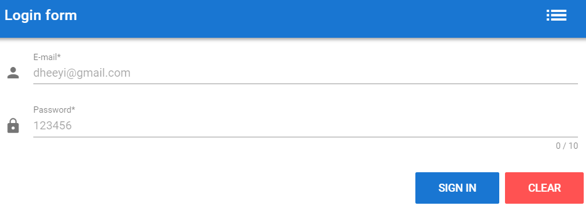
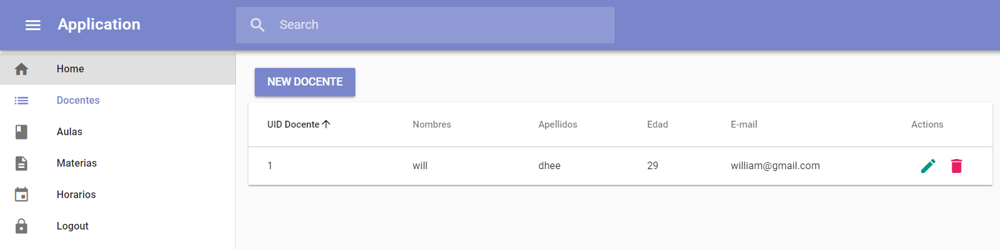

# VueJS, Node, Express, Sequelize y PostgreSQL
> Application para la manejo de registros de Docentes, Aulas, Materias y Horarios.

>GooWil App 




## Installation

BackEnd:

```sh
cd backend
npm install
```

FrontEnd:

```sh
cd frontend
npm install
```

## Usage

#### Configuracion de la base de datos PostgreSQL [backend/server/config/config.json]
        
    {
      "development": {
        "username": "postgres",
        "password": "sample",
        "database": "goomi_dev",
        "host": "127.0.0.1",
        "port": 5432,
        "dialect": "postgres"
      }
      ...
    }

## Development setup

Para poder ejecutar la aplicacion, se hace necesario tener corriendo la app backend y frontend

```sh
cd backend
npm start
```

```sh
cd frontend
npm run dev
```

## Release History

* 0.0.1
    * Work in progress

## Soluciones 
- Para FE y BE se tiene todas las vistas para los listados, modificaciones y eliminaciones.
- Registro y listado de docentes (CRUD) para BE y FE.
- Registro y listado de aulas (CRUD) para BE y FE.
- Registro y listado de Materias (CRUD) para BE y FE.
- Registro y listado de Horarios (CRUD) para BE y FE. (Falta)
- Validaciones en los formularios (Demo Login de la App)

## Soluciones Opcionales
- Se valida los datos desde BE.
- Existe validacion en formulario (Demo login de la App).
- Es responsivo la Aplicacion. 

## Meta

Dheeyi William – [@YourTwitter](https://twitter.com/dheeyi) – dheeyi@gmail.com tel:(+591) 76567373

See ``LICENSE`` for more information.

[https://github.com/dheeyi/](https://github.com/dheeyi/)

